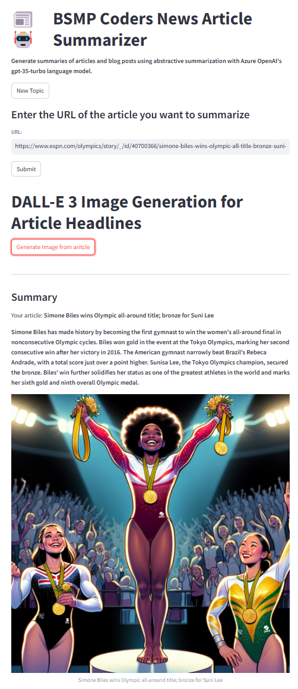

# Homework 7: Build an Multi-Interactive AI Web App 🌟

## Overview

In this assignment, you’ll build an interactive web app using Streamlit or Flask that combines at least two different AI models or APIs. This is a great opportunity to explore and integrate various AI technologies into a single application!

## Objectives

1. **Create a Web App**: Build a web app using Streamlit or Flask.
2. **Use AI Models**: Incorporate at least one image-based AI model (like Custom Vision AI, DALL-E 3, SAM2, or an open-source alternative).
3. **Incorporate Text-Based AI**: Integrate a text-based AI model or service (such as Text to Speech (TTS) or a chat model).
4. **Interactive Features**: Ensure your app provides interactive and engaging features for users.

## Examples of What You Can Do

Here are a few ideas to inspire your project:

- **Soccer AI App**: Use Custom Vision AI to classify soccer team logos and display results. Add a feature where users can generate a sports headline using a chat model and have it read out loud with TTS.

- **Creative News App**: Let users upload images to be analyzed by an image-based model. Use a chat model to create a news headline based on the analysis, and then use DALL-E 3 to generate a cover image for the headline. Add TTS to read out the headline.

- **Artistic Generator**: Allow users to input a description to generate images using DALL-E 3. Use TTS to read a description or a story related to the generated image.

## Requirements

1. **Web App Framework**: Use either Streamlit or Flask to build your app.
2. **AI Models**:
   - **Image-Based Model**: Choose at least one from Custom Vision AI, DALL-E 3, SAM2, or a similar model.
   - **Text-Based Model**: Integrate either a TTS service or a chat model.
3. **Functionality**: Your app should be interactive and provide a seamless experience combining the AI models.
4. **GitHub Commit and Push To Submit**

## Azure Open AI Secrets and `.env` file
👉 dont forget to create the `.env` and add the secrets for `AZURE_OPENAI_ENDPOINT` and `AZURE_OPENAI_API_KEY` from lesson2. here is the secrets in our bam summer site you can also access [ENV_SECRETSS](https://m365x06915360.sharepoint.com/:t:/s/advcoding/EUYQ2hT4ZqxLqQe2OPtOGuMBLMRqjx-lRlt3TmzP4gMKbw?e=DgzPmJ) 

## Getting Started

1. **Set Up Your Environment**: Use Codespaces or set up your local environment with the required libraries and frameworks.
2. **Implement at least 2 Models (one image (e.g., [customvision.ai](https://learn.microsoft.com/en-us/azure/ai-services/custom-vision-service/quickstarts/image-classification?tabs=linux%2Cvisual-studio&pivots=programming-language-python)/[dalle](https://learn.microsoft.com/en-us/azure/ai-services/openai/dall-e-quickstart?tabs=dalle3%2Ccommand-line&pivots=programming-language-python)) and one text ([chat](https://learn.microsoft.com/en-us/azure/ai-services/openai/chatgpt-quickstart?tabs=command-line%2Cpython-new&pivots=programming-language-python)) /audio ([tts](https://learn.microsoft.com/en-us/azure/ai-services/openai/text-to-speech-quickstart?tabs=command-line)) based)**: Choose the AI models or services you want to integrate into your app. This can be based on our previous lessons or something new. 
3. **Build Your App**: Create a user-friendly interface that allows interaction with the AI models.
4. **Test Your App**: Ensure everything works smoothly and fix any issues.
5. **Submit Your Work**: commit and push your repo when finished. 

## Resources

- **Custom Vision AI**: [Azure Custom Vision](https://www.customvision.ai/)
- **DALL-E 3**: [Azure OpenAI](https://azure.microsoft.com/en-us/services/openai/)
- **Text to Speech (TTS)**: [Azure Text to Speech](https://azure.microsoft.com/en-us/services/cognitive-services/text-to-speech/)
- **SAM2**: [Segment Anything 2](https://ai.meta.com/sam2/)

## Tips

- Start by planning out the features and layout of your app.
- Explore the documentation of the APIs you plan to use.
- Keep your code organized and comment on your functions to make it easy to understand.
- Have fun and be creative with your app!

Good luck, and happy coding! 🚀

# Here is an example (`ex_streamlit_news_app.py`) News Article Summarizer 📰  
   
This example showcases a Streamlit application that summarizes articles and generates images based on the summaries. The app uses Azure OpenAI's GPT-3.5-turbo for summarization and DALL-E 3 for image generation.  


   
## Key Features  
1. **Article Summarization**: Enter a URL of an article to get a concise summary.  
2. **Image Generation**: Generate an image based on the summary using DALL-E 3.  
   
## How It Works  
1. **Enter Article URL**: Users enter the URL of an article they want to summarize.  
2. **Generate Summary**: The app fetches the article content, processes it, and generates a summary using GPT-3.5-turbo.  
3. **Generate Image**: Users can generate an image based on the summary using DALL-E 3.  
   
### Example Usage  
1. **Enter the URL of the article you want to summarize**:  
   ```markdown  
   URL: https://www.espn.com/olympics/story/_/id/40700366/simone-biles-wins-olympic-all-title-bronze-suni-lee  
   ```  
2. **Generate Image from Summary**: Click the button to generate an image based on the article summary.  
   